Emojis are deeply flawed. They:
- lack a lot of emotional cues ("Ok 🙂" are you being sarcastic? passive-aggressive? annoyed?),
- change meanings depending on who you're texting to (Gen Z uses 😭 for everything)
- look different on each platform,
- are Japanese-American centric (💹 why only Yen? most mailboxes around the world don't look like 📫) and lack representation for other countries' cultural symbols and references (where are emojis for Vietnamese _bánh mì_, Indian _sari_, or Mayan _Chichén Itzá_?),
- are a product of Silicon Valley (American tech companies corporatize emojis by making them have big eyes, big mouth, and yellow skin).

So much for a paralanguage. Despite it being used by billions of people and LLMs like ChatGPT, it's nowhere near universality. **It's time to reject [emojipocalyspe](https://www.openbible.info/blog/2015/05/heralds-of-the-emojipocalypse/) and return to emoticons and kaomoji.** However, they aren't perfect. Emoticons, like emojis, are susceptible to semantic shift, while kaomojis are disruptive and only for social signaling. **Still, they're the only way to reject emojipocalyspe, else how can we express emotional cue via text?** Not everyone uses stickers and GIFs, and they aren't supported on every platform.

Emoticons and some basic kaomojis can easily be typed via your keyboard, but most kaomojis, especially complex ones, can't or is awkward to do so. You would have to either copy-paste somewhere on the internet, save them as text shortcuts, or use your OS features/app/keyboard like Windows Clipboard Manager, [Raycast](https://www.raycast.com/yalishanda/kaomoji-search), or using Japanese keyboard.

On mobile, there isn't a perfect kaomoji keyboard app, as far as I'm aware. Gboard, for what it's worth, is a product of Google, which is bound to collect your data. Other "kawaii cute" (tautology lol) kaomoji apps offer unnecessary features like fonts and custom symbols. Of course, there are also paid or freemium ones locking a lot of kaomojis behind a paywall. Throughout my research and testing, I've noticed all of them:
- don't have a feature to long press to choose variants
- don't have a button to change all eyes from x to y or remove parentheses
- don't have a feature add/remove/edit default and user-created kaomojis
- don't have search feature
- have a limited amount of kaomojis, most of which are kinda basic

Because of this fact, I've been wanting to create a kaomoji app.

| Demo 1 | Demo 2 |
| :---: | :---: |
|  |  |

(sorry for the terrible demo `（＞人＜；）` hopefully I get my idea across)

| [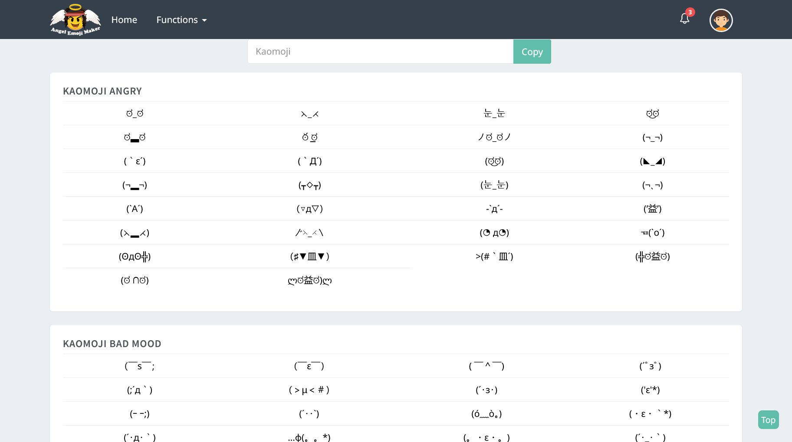](https://emoji-maker.com/kaomoji_copy) | [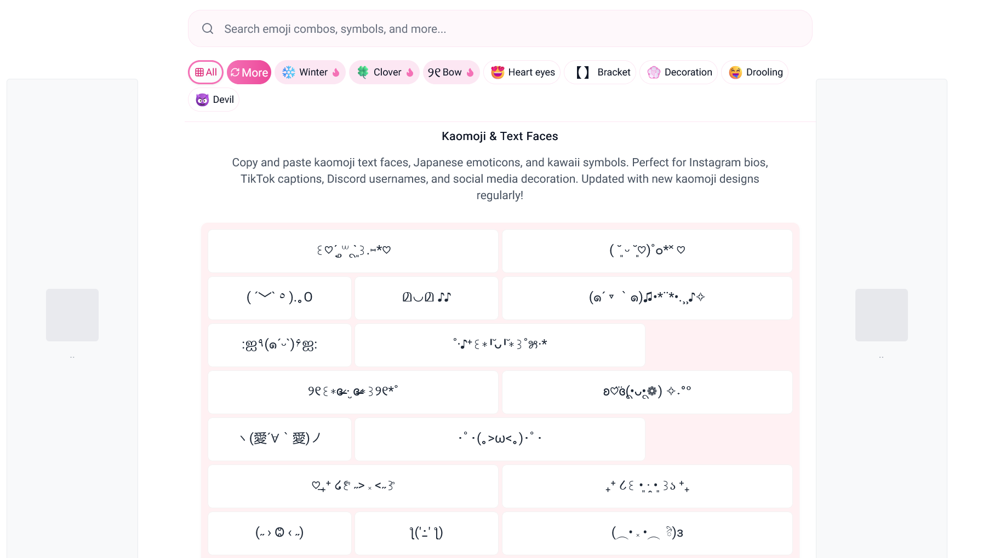](https://cuteinternet.com/kaomoji) |
| --- | --- |
| Row 1 | Row 1 |
| Row 2 | Row 2 |
| Row 3 | Row 3 |
| Row 4 | Row 4 |
| Row 5 | Row 5 |
| Row 6 | Row 6 |

| No. | Website (click to be redirected) |
| :--- | :--- |
| 1 | |
| 2 |  |
| 3 | [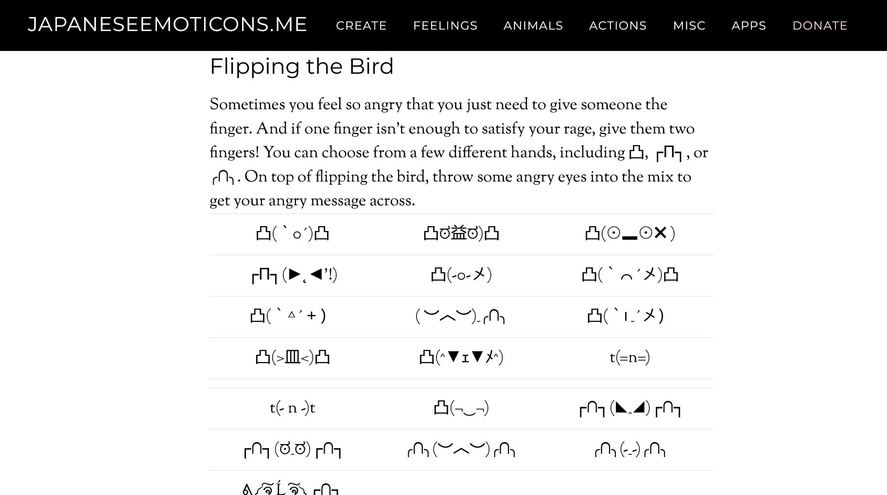](https://japaneseemoticons.me/all-japanese-emoticons/) |
| 4 | [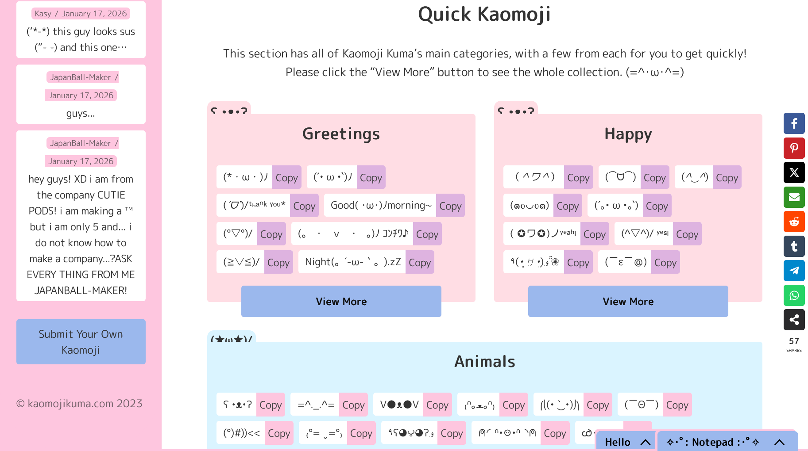](https://kaomojikuma.com/) |
| 5 | [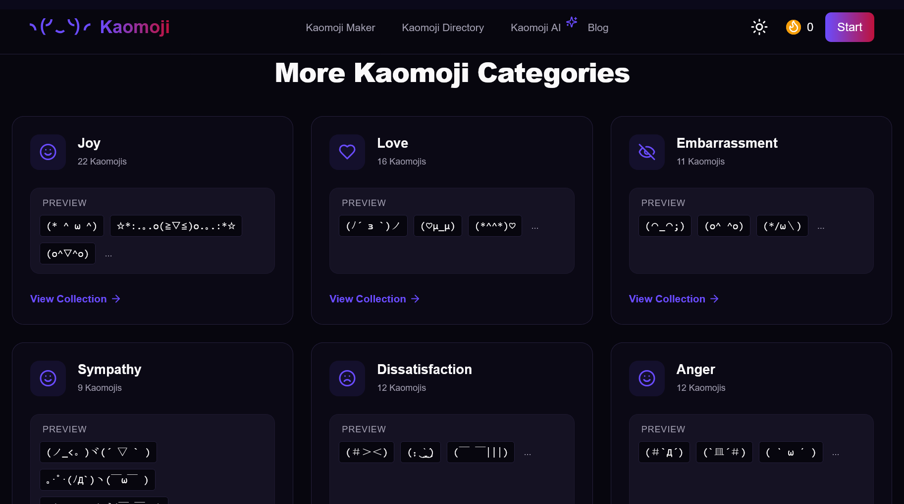](https://kaomoji.life/categories) |
| 6 | [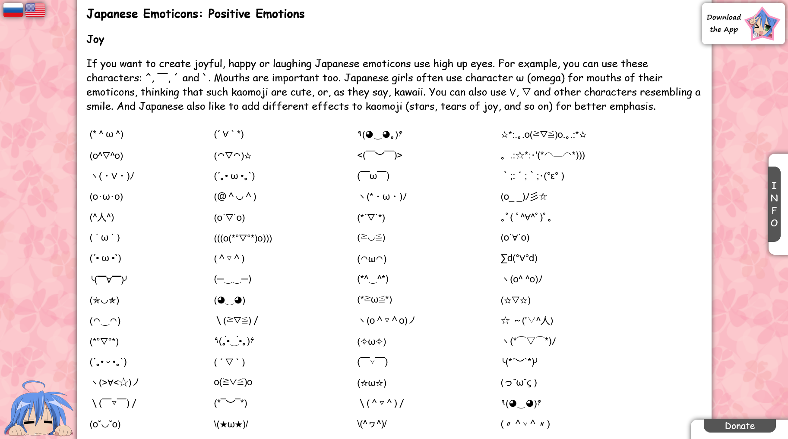](https://kaomoji.ru/en/#contents) |
| 7 |  |
| 8 | [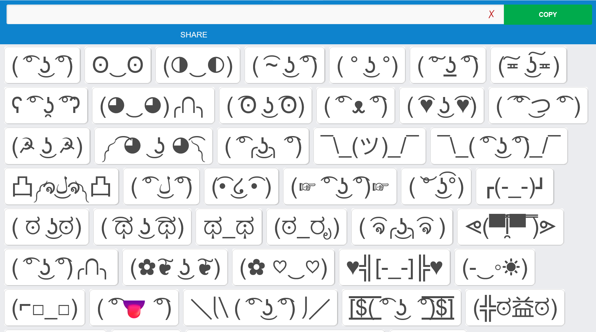](https://www.lennyfac.es/) |
| 9 | [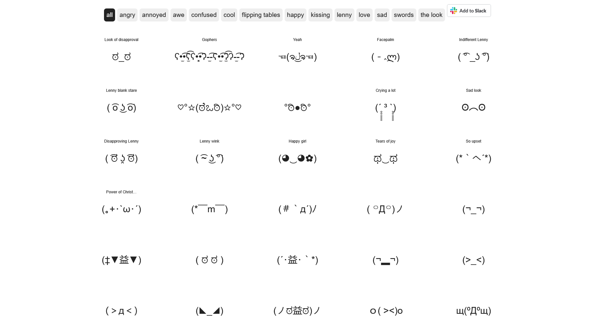](https://looks.wtf/) |
| 10 | [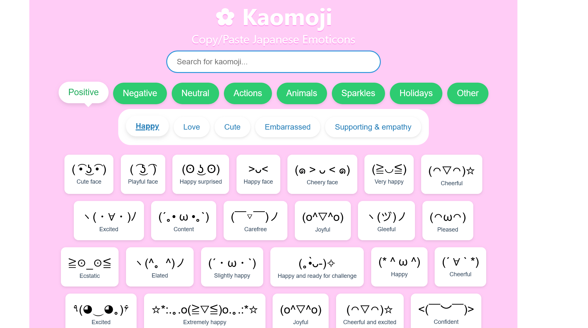](https://www.psd-dude.com/kaomojis/) |
| 11 | [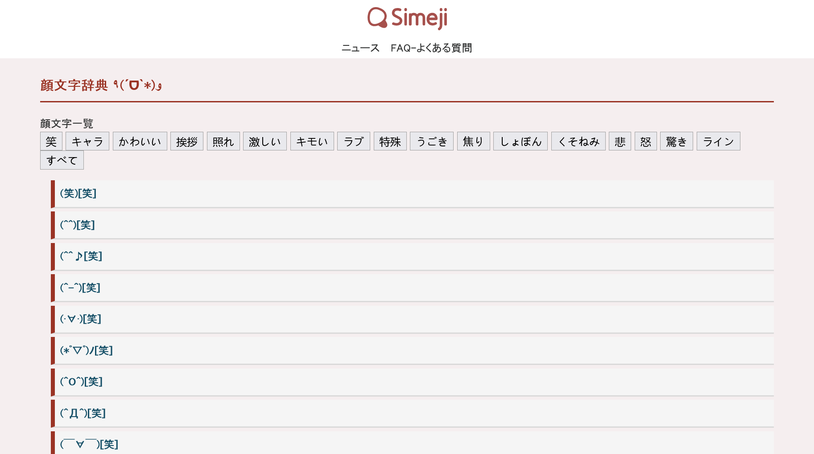](https://simeji.me/kaomoji) |
| 12 | [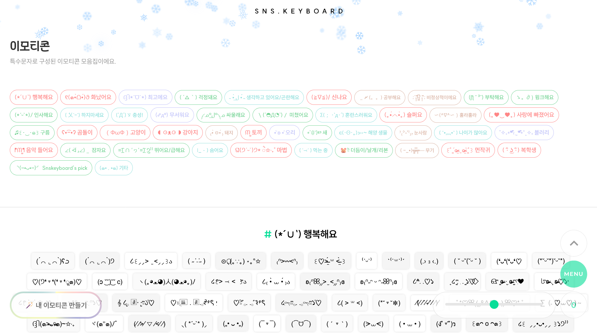](https://snskeyboard.com/emoticon/) |
| 13 | [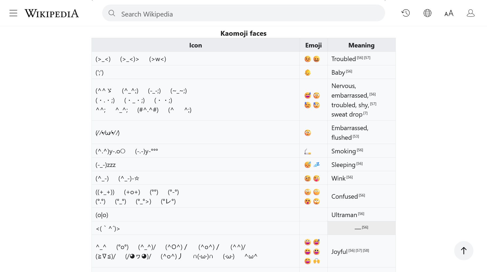](https://wikipedia.org/wiki/List_of_emoticons#Eastern) |
| 14 | [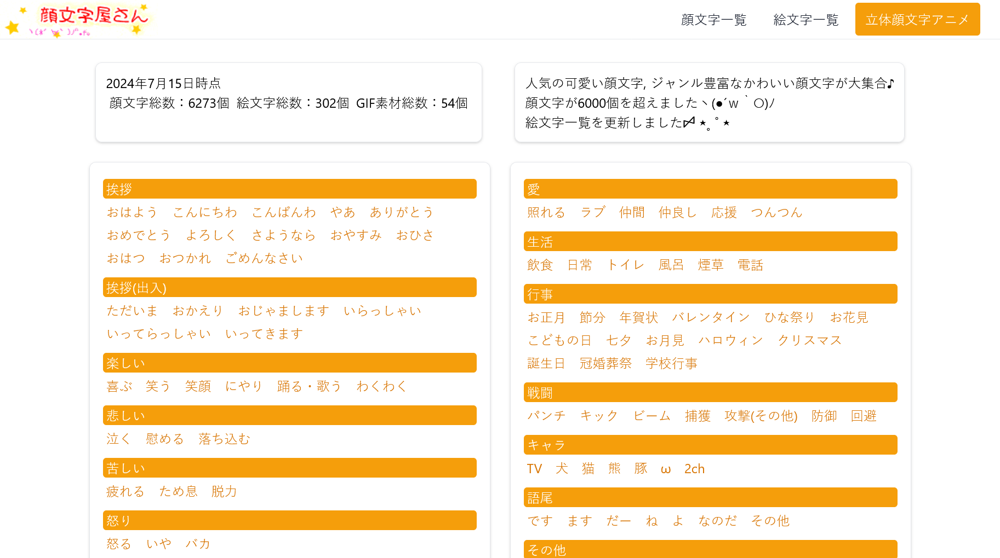](https://kaomojiya.com/) |
