Emojis are deeply flawed. They:
- lack a lot of emotional cues ("Ok 🙂" Are you being sarcastic? Passive-aggressive? Annoyed?),
- change meanings depending on who you're texting to (Gen Z uses 😭 for everything),
- are used disproportionately (social media uses the same emojis like 😭 and 💀 year after year while most emojis go underused),
- look different on each platform,
- are Japanese-American centric (🚅 why are there so many train emojis? most mailboxes around the world don't look like 📫) and lack representation for other countries' cultural symbols and references (where are the emojis for Vietnamese _bánh mì_, Indian _sari_, or Mayan _Chichén Itzá_?),
- are a product of Silicon Valley (American tech companies corporatize emojis by making them have big eyes, big mouth, and yellow skin).

So much for a paralanguage. Despite it being used by billions of people and LLMs like ChatGPT, it's nowhere near universality. **It's time to reject [emojipocalyspe](https://www.openbible.info/blog/2015/05/heralds-of-the-emojipocalypse/) and return to emoticons and kaomoji.** However, they aren't perfect. Emoticons, like emojis, are susceptible to semantic shift, while kaomojis are disruptive and only for social signaling. **Still, they're the only way to reject emojipocalyspe, else how can we express emotional cue via text?** Not everyone uses stickers and GIFs, and they aren't supported on every platform.

Emoticons and some basic kaomojis can easily be typed via your keyboard, but most kaomojis, especially complex ones, can't or is awkward to do so. You would have to either copy-paste somewhere on the internet, save them as text shortcuts, or use your OS features/app/keyboard like Windows Clipboard Manager, [Raycast](https://www.raycast.com/yalishanda/kaomoji-search), or Japanese keyboard.

On mobile, there isn't a perfect kaomoji keyboard app, as far as I'm aware. Gboard, for what it's worth, is a product of Google, which is bound to collect your data. Other "kawaii cute" (tautology lol) kaomoji apps offer unnecessary features like fonts and custom symbols. Of course, there are also paid or freemium ones locking a lot of kaomojis behind a paywall. Throughout my research and testing, I've noticed all of them:
- don't have a feature to long press to choose variants
- don't have a button to change all eyes from x to y or remove parentheses
- don't have a feature add/remove/edit default and user-created kaomojis
- don't have search feature (fair enough because you have to create a database with names and categories)
- have a limited amount of kaomojis, most of which are kinda basic

Because of this fact, I've been wanting to create a kaomoji mobile app, or at the very least create a list of cool kaomojis.

Like any other projects, I first collected material and references. I use an [iPhone](https://github.com/nhantrichuyenanh/ios-ofb), so I downloaded all kaomoji keyboard apps in the App Store and narrowed down to [Text Faces for Texting](https://apps.apple.com/app/text-faces-for-texting/id656987566) and [Japanese Emoticons for Texting](https://apps.apple.com/app/japanese-emoticons-for-texting/id807320735), both of which are no different to each other. While scrolling through the kaomojis in the app, I found some that I personally like:

| （ｏ＿Ｏ） | （O_O） | (/ _ ; ) | (^^;) |
|----|----|----|----|
| `‧˚₊*̥(* ⁰̷̴͈꒨⁰̷̴͈)‧˚₊*̥` | `(๑o̴̶̷̥᷅﹏o̴̶̷̥᷅๑)꒳ᵒ꒳ᵎᵎᵎ` | `( p_q)` | `ヽ(；^ ^)ノﾞ ．．．...___〇` |
| `(　´_ゝ｀)` | `ε=ε=┏( >_<)┛　(ノ_ _)ノ` | `＼_(･ω･｀)` | `(((( ＿ ＿)☆ ≡〇　　┏┓` |
| `＼_(´ι _` 　)` | `＼＿ﾍ(◕‿◕✰)` | `(( _ _ ))..zzzZZ` | `(>ω^)` |
| `ヾ(*･ω･*)o` | `┬──┬ ¯\_(ツ)` | `(＾＾)ｂ` | `Σ(-᷅_-᷄๑)` |
| `(╯°□°）╯︵ ( . 0 .)` | `(o_O) !` | `＾ω＾` | `(*･ω･)ﾉ”┌iii┐♡` |
| `(¦ꒉ[▓▓]` | `(¦3[___]` | `ヾ(^_^) byebye!!` | `¯\_(ツ)_/¯` |
| `((;ﾟДﾟ))` | `(／_^)／　　●　＼(^_＼)` | `(ﾟρﾟ*)` | `(*´﹃`)` |
| `ヽ(^o^)ρ┳┻┳°σ(^o^)ノ` | `(⊙.☉)7` | `(◔ૂ◔)` | `Ю　○三　＼(￣^￣＼)` |
| `ಠ‿↼` | `( ͡~ ͜ʖ ͡°)` | `(╯°□°)╯︵ sɯɐxǝ` | `(⌒▽⌒)♡` |
| `(º﹃º )` | `(╯°□°)╯︵ ʞɹoʍ` | `( ͡°ω ͡°)` | `͡° ͜ʖ ͡°` |
| `(╯°□°)╯︵ ƃuıʎpnʇs` | `ヽ( ͝° ͜ʖ͡°)ﾉ` | `_(┐「ε:)_` | `{zzz}°°°( -_-)>c[_]` |
| `(ʃƪ˘ﻬ˘)` | `(*^ω^)` | `ʕ•̫͡•ॽु✚⃞ྉ*✲ﾟ*｡⋆` | `ヽ(ー_ー )ノ` |
| `ヽ(´ー｀)┌` | `(¬‿¬)` | `( ͡° ͜ʖ ͡°)` | `（☆ω☆*）` |
| `│_・)` | `( ?´_ゝ｀)` | `(;-_-)ノ` | `(´,,•ω•,,｀)` |
| `¯\(°_o)/¯` | `t( -_- t )` | `((“Ｑ(´▽｀｡)` | `_へ__(‾◡◝ )>` |
| `_(:3」∠)_` | `(^q^)` | `（◞‸◟）` | `ヾ(^ ^ゞ` |
| `(ﾉ_-｡)` | `(＾＾；)` | `꒰ີᵒ̴̶̷͈́༝ॢᵒ̴̶̷͈̀ ૢ꒱ ິ` | `(｡･･｡)` |
| `(*_ _)人` | `＜(。_。)＞` | `_/＼●_` | `orz` |
| `ヾ(≧∇≦)ゞ` | `(#^^#)ゞ` | `(・・？)` | `(☉_☉)` |
| `(゜-゜)` | `( ⚆ _ ⚆ )` | `＿│￣│○` | `(*^^*)` |
| `(〃ω〃)` | `(ﾉ_ _)ﾉ` | `(　｀_ゝ´)` | `(✧≖‿ゝ≖)` |
| `(^ｗ^)` | `<(｀^´)>` | `(눈_눈)` | `(> ^_^ )>` |
| `（ｏ＿Ｏ）` | `（O_O）` | `(/ _ ; )` | `(^^;)` |

(*) Temporarily replaced `|` with `]` so that the kaomoji can be displayed in GFM Table.

After using the app, I have what a kaomoji app would look like in mind:

| Demo 1 | Demo 2 |
| :---: | :---: |
| 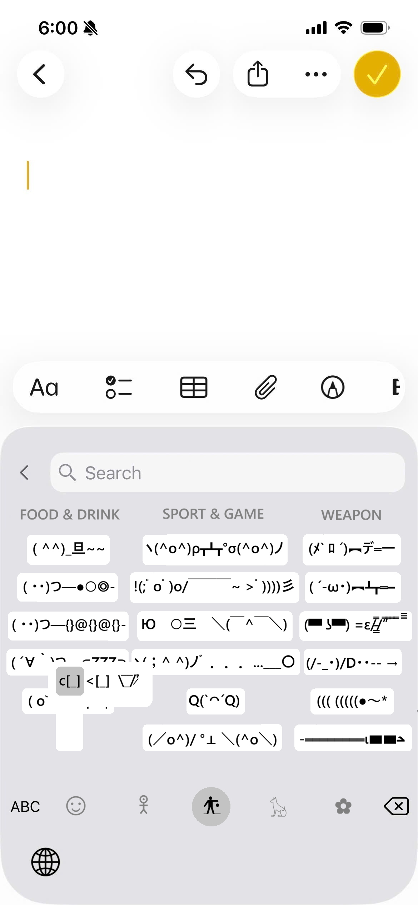 | 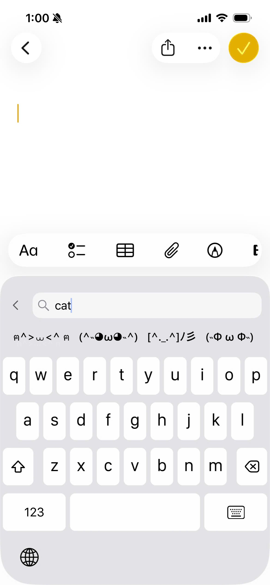 |

(Keyboard being used in the demo is from Grammarly.)

Now I need to create a list of kaomojis for the app. While collecting kaomojis for the list, I found some cool ones. Below these are the sources rendered as images that I collected from, click on them to be redirected.

| ―⊂ZZZ⊃ | [̲̅$̲̅(̲̅ ͡° ͜ʖ ͡°̲̅)̲̅$̲̅] | (　´_ゝ｀) | ((d[-_-]b)) |
|----|----|----|----|
| `\̅_̅/̷̚ʾ` | `ヽ(^o^)ρ┳┻┳°σ(^o^)ノ` | `_へ__(‾◡◝ )>` | `♪o<( ´∀｀)っ┌iii┐` |
| `c(_)` | `ヽ(；^ ^)ノﾞ ．．．...___〇` | `(＿ ＿*) Z z z` | `(۶ૈ ᵒ̌ Дᵒ̌)۶ૈ=͟͟͞͞ ⌨` |
| `✴==≡눈` | `Ю　○三　＼(￣^￣＼)` | `ꍞ(¦ 3[▓▓]` | `(╯°□°)╯︵ ʞooqǝɔɐℲ` |
| `☆彡` | `( っ'-')╮ =͟͟͞͞🏀` | `( °̥̥̥̥̥̥̥̥◡͐°̥̥̥̥̥̥̥̥)` | `-●●●-ｃ(ω｀ｃ )` |

| [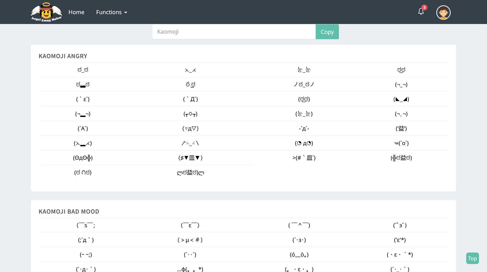](https://emoji-maker.com/kaomoji_copy) | [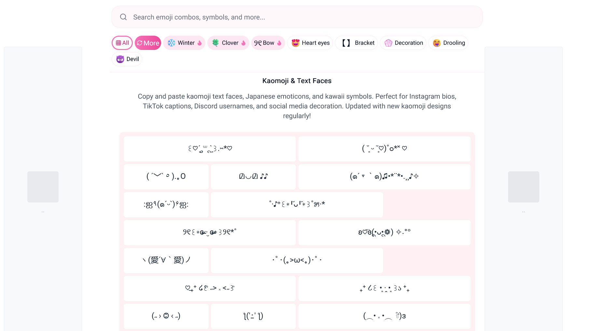](https://cuteinternet.com/kaomoji) |
| --- | --- |
| [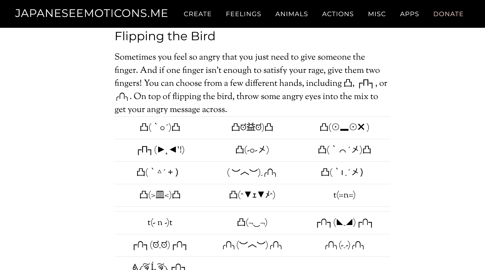](https://japaneseemoticons.me/all-japanese-emoticons/) | [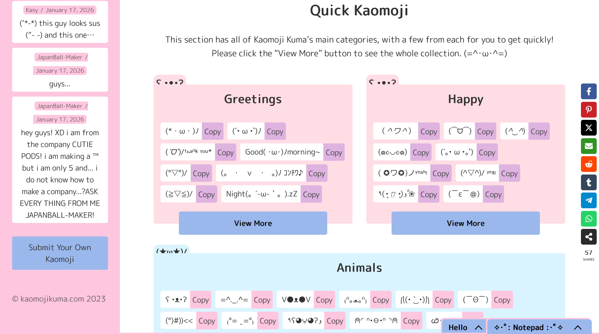](https://kaomojikuma.com/) |
| [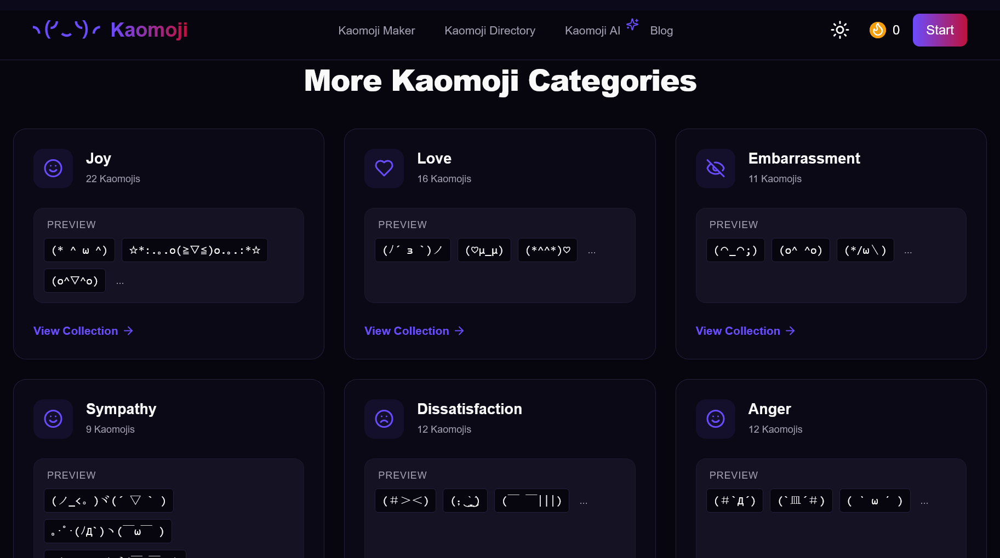](https://kaomoji.life/categories) | [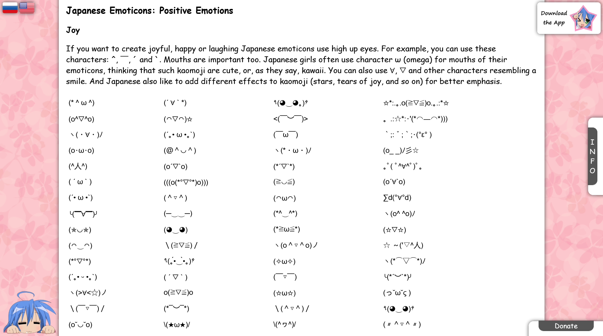](https://kaomoji.ru/en/#contents) |
| [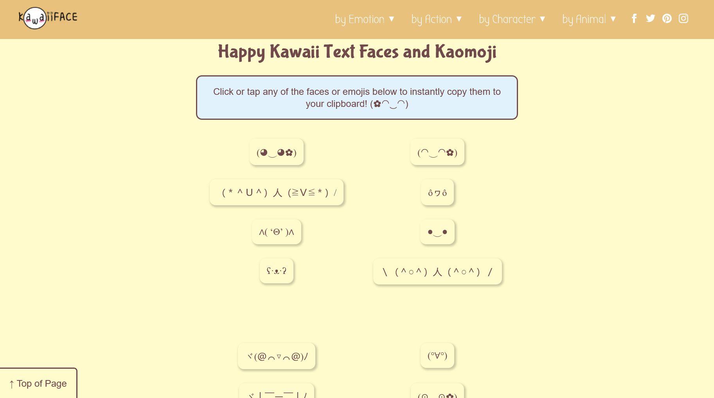](https://kawaiiface.net/happy-faces) | [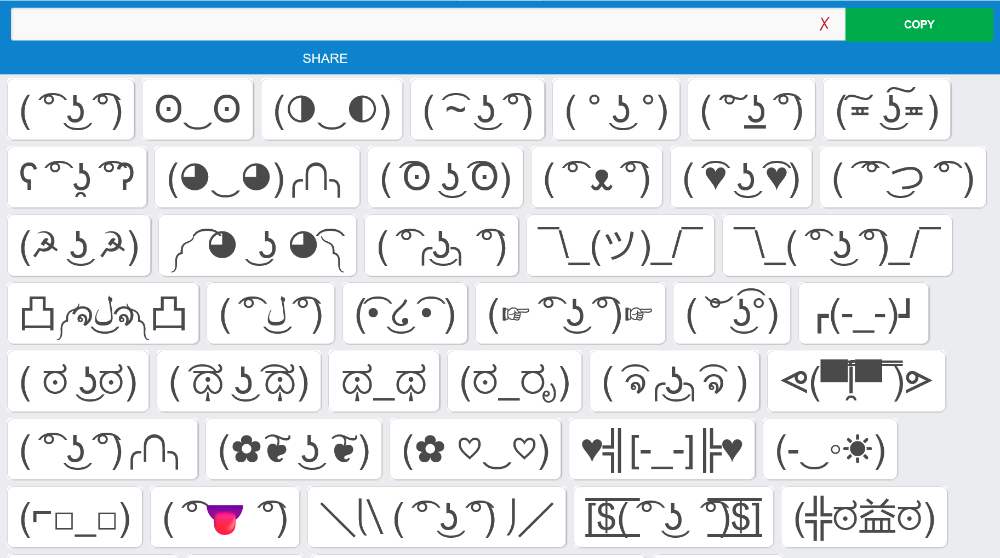](https://www.lennyfac.es/) |
| [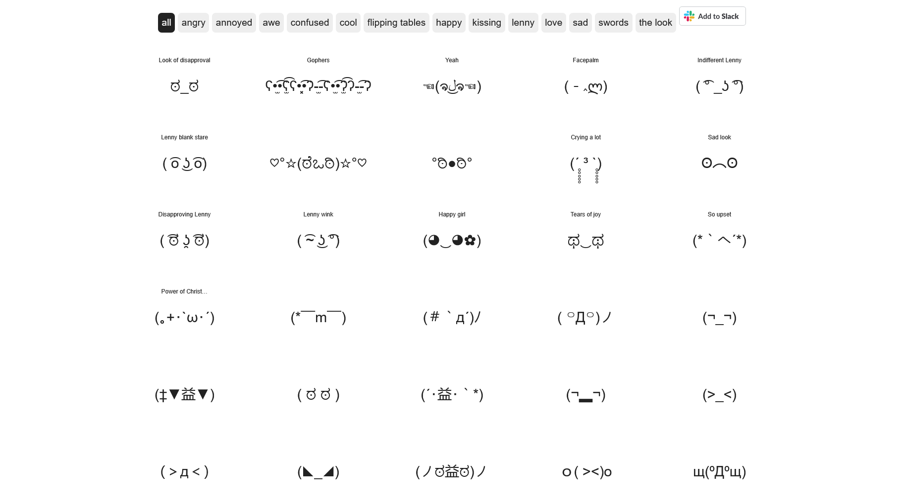](https://looks.wtf/) | [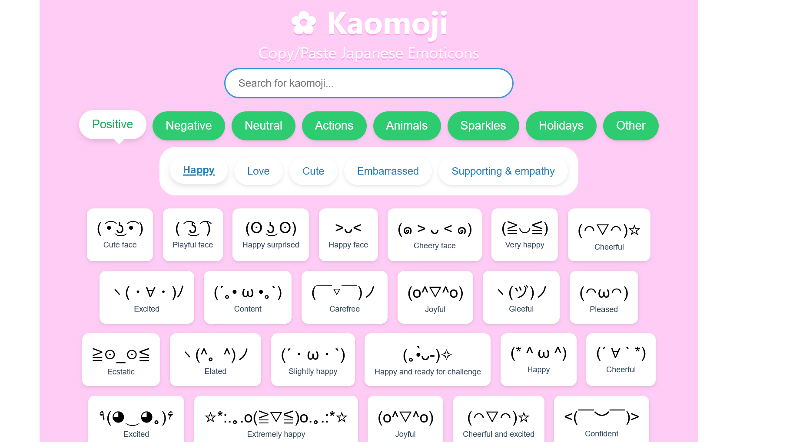](https://www.psd-dude.com/kaomojis/) |
| [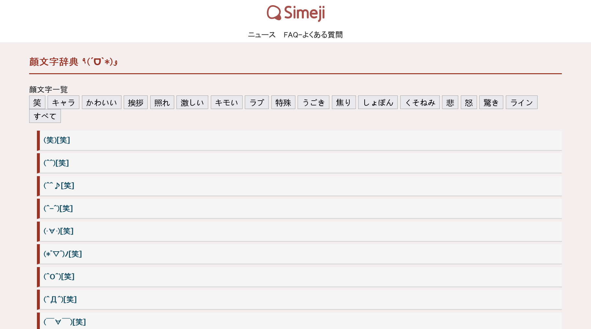](https://simeji.me/kaomoji) | [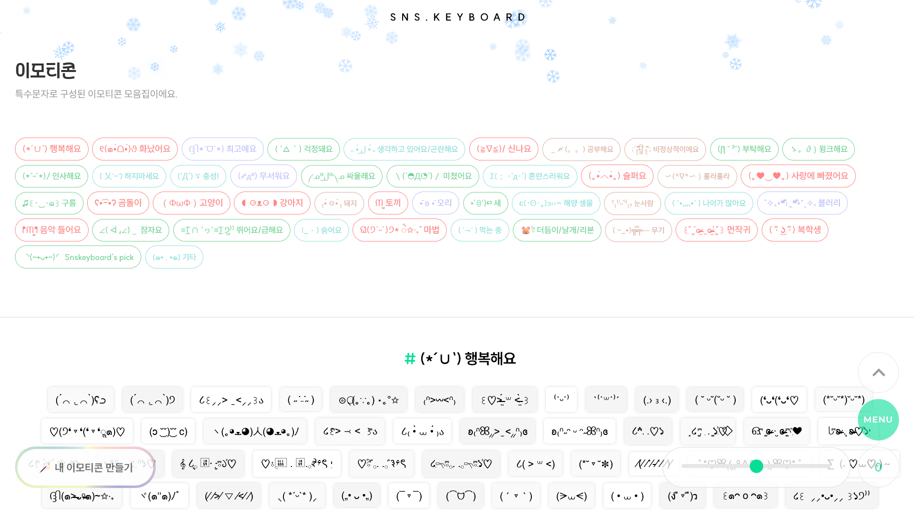](https://snskeyboard.com/emoticon/) |
| [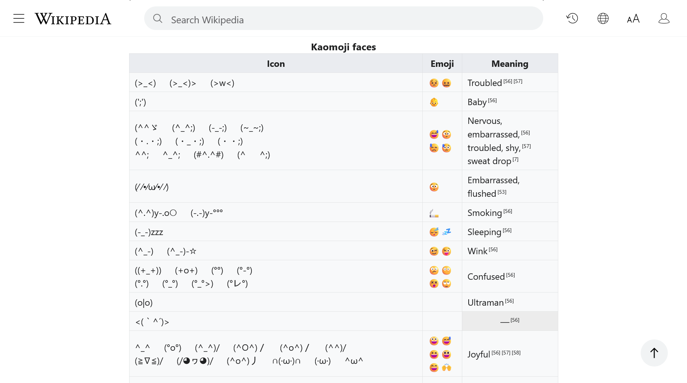](https://wikipedia.org/wiki/List_of_emoticons#Eastern) | [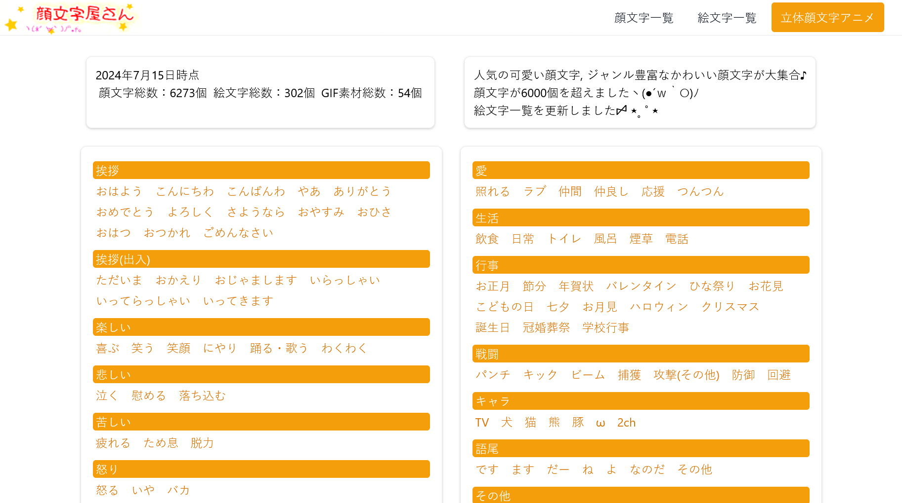](https://kaomojiya.com/) |
| [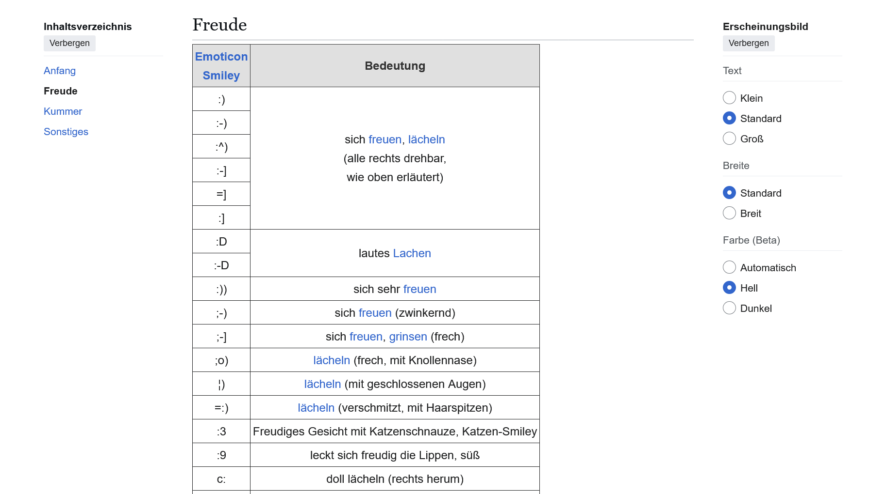](https://de.wiktionary.org/wiki/Verzeichnis:International/Smileys) | [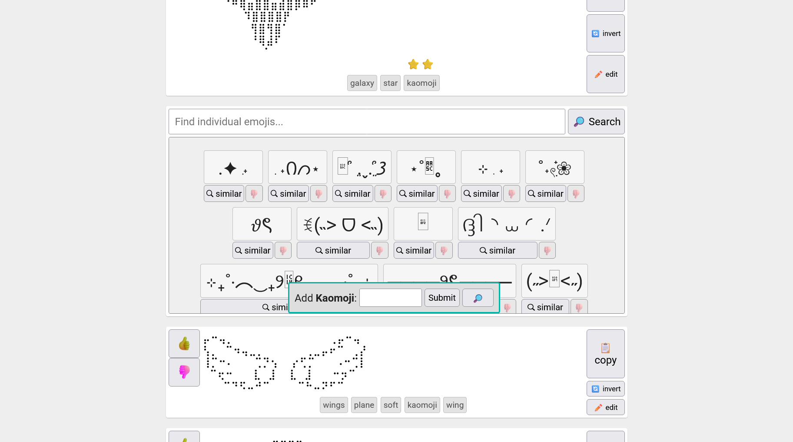](https://emojicombos.com/kaomoji) |

Unfortunately, I don't have a Mac to start coding the app and a job to pay the annual fee of $100 for the Apple Developer Program. In the future when I do have a Mac and a job, I'll revisit this repo.
